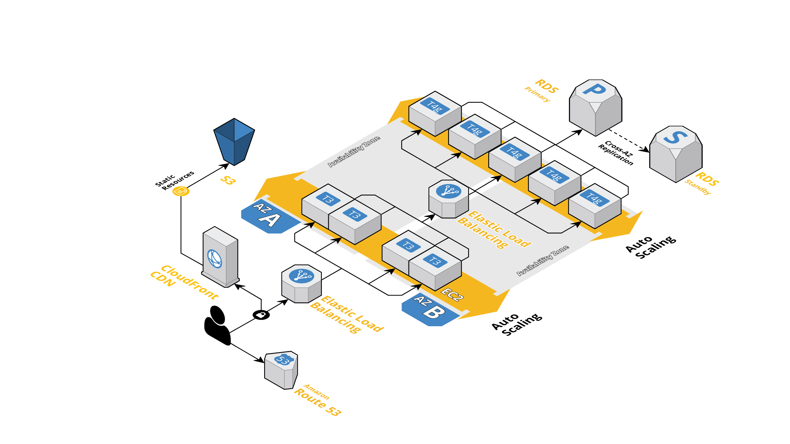
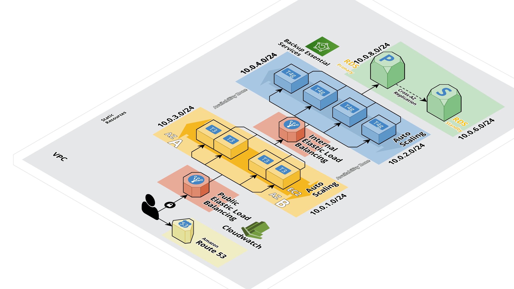
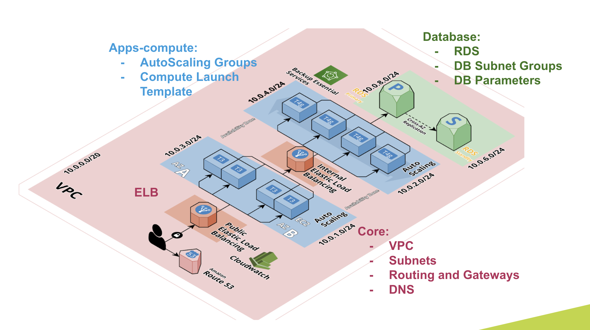

# CloudNights : Terraform Code Samples

Hi this is H from the CloudOps Studio at Globant, here you will find all the code samples, I also will leave a couple of CICD Samples  to orchestrate your terraform.
Remember our reference architecture : 

In order to check each of the Terraform Project Structure what I will be creating 
feature branches, so here is the summary : 

- feature-terralith
- feature-terramod
- feature-terramond^n
- feature-terraservice
- feature-terraservice+
